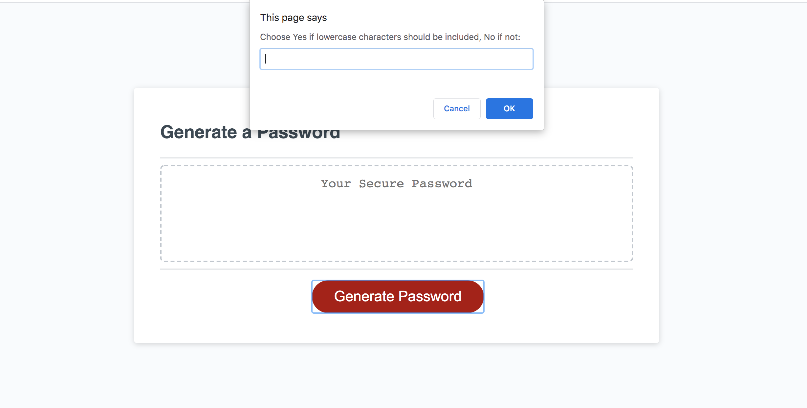

# Password Generator Code

## The code generates a random password from the user given options.

### User Story: 
AS AN employee with access to sensitive data
I WANT to randomly generate a password that meets certain criteria
SO THAT I can create a strong password that provides greater security

#### Steps:

1) Get user input for required password length.
2) Get user input for the character types required to be in the password.
3) Create a password from the options given by the user.
4) Display the password on the page.

#### Screenshots of what the app looks like:
##### Main Page

##### Select the password length

##### Select the character types to be used in the password

##### Display the password

#### Link to my website: https://aadi1988.github.io/password-generator/

